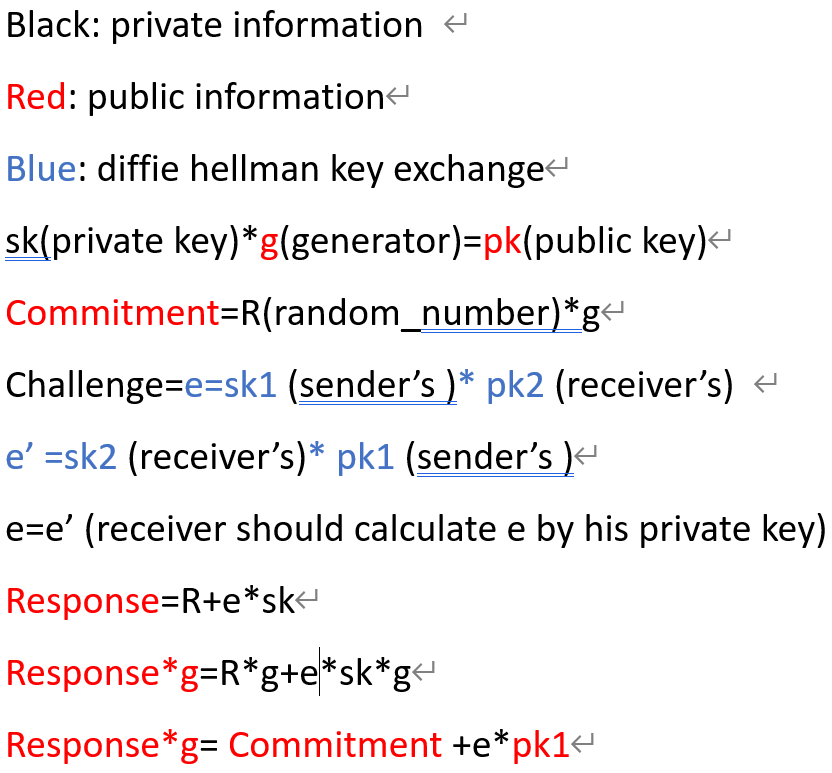

# zk_rollup
this circom project can do the transaction without let the bank knows your private key and packing serveal transcation to generate a new merkle tree that contain all the transactions inside. It's the idea about zero knowledge proof, user can do withdraw money, pay money to someone, and recive money from others. And each part they have to use their private key, so it's undeniable after doing the transcation.

# how to do the transcation
In transcation.circom, I had written three template (pay to someone, withdraw, recive), if you want to pay money to someone, you have to enter your private key and balance for proving your account is in merkle tree, check payment is lessthan blance, and use your public key to do a Diffie–Hellman key exchange in signature, so your payment is undeniable for reciver. When we talk about withdraw, that is almost the same as pay, but you don't have to make the signature. As reciver you have to solve  Diffie–Hellman key exchange problem, so the identity of two traders is clear, and after you do any transcation, you should update merkle leaf. 

## babyjub_caculate
I use babyjub to generate public key because that is friendly to circom.In making signature, it contain the classic sigma protocol, but I add Diffie–Hellman key exchange in that(when generating challenge). 

$$private\quad key * g (generater) = public\quad key  $$
$$commitment= random\quad number * g  $$
$$challenge=hash (sender's\quad private\quad key, reciver's\quad public\quad key, payment) (it's\quad Diffie–Hellman\quad key\quad exchange) $$
$$response=random\quad number + challenge*sender's\quad private\quad key  $$

## keccak256 
that is hasher for merkle tree and digital envelope

# merkle tree 
It's a useful function for rollup the signature , if someone wants to proof his signature is one of the leaf of tree, beside the leaf, he needs to provide three things
1. guide number(it will be change to binary to show the leaf and the father is on left or right)
2. path element (the brothers in the tree)
3. root

